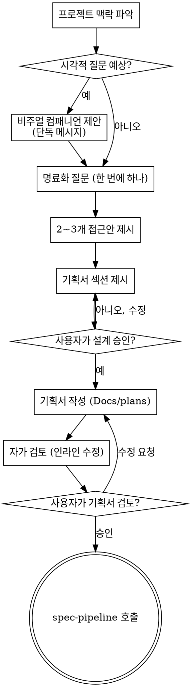

Recommended Model : Codex Opus

# `plan-writer` 스킬 지침 — 아이디어를 기획서로

아이디어를 자연스러운 협업 대화로 다듬어 **기획서**로 완성하는 단계다. 한 번에 한
질문씩 의도를 좁히고, 이해가 서면 기획서를 제시해 승인을 받는다.

## 이 스킬은 '기획서'를 만든다 (명세서가 아니다)

kit 파이프라인의 맨 앞단이다. `spec-writer`와 산출물·관점이 다르다.

| | plan-writer (이 스킬) | spec-writer |
|---|---|---|
| 만드는 것 | **기획서** | 개발 명세서 |
| 답하는 질문 | 무엇을·왜·누구를 위해·성공 기준·범위 | 어떻게 구현 (파일·API·데이터·테스트) |
| 산출물 위치 | `Docs/plans/YYYY-MM-DD-<주제>.md` | (스택별) 개발 명세서 |
| 다음 단계 | 이 기획서를 입력으로 `common/spec-pipeline` 호출 | 명세 기반 구현 |

기획서는 구현 방법을 적는 곳이 **아니다**. 아키텍처·컴포넌트·API 설계는 명세 단계로
미룬다. 여기서는 제품 의도와 범위를 합의하는 데 집중한다.

<HARD-GATE>
기획서를 제시하고 사용자가 승인하기 전에는 명세 작성 스킬(spec-writer·spec-pipeline)
이나 어떤 구현 행동도 하지 않는다. 프로젝트가 아무리 단순해 보여도 적용된다.
사용자가 "기획·명세 건너뛰고 바로 코드"라고 **직접 지시해도** 유지한다 — 승인 게이트는
사용자 본인의 승인을 위한 것이고, 짧은 기획서를 제시하는 것이 그 지시를 존중하는
최소 형태다(건너뛰는 게 아니라 한 문단으로 압축하는 것이다).
</HARD-GATE>

규칙의 문자를 어기는 것은 규칙의 정신을 어기는 것이다.

## 안티패턴: "이건 너무 간단해서 기획 불필요"

모든 작업이 이 단계를 거친다. 작은 기능, 문구 변경, 화면 하나도 마찬가지다. "간단한"
작업일수록 검토되지 않은 가정이 헛수고를 만든다. 기획서는 짧아도 된다(정말 단순하면
몇 문장). 하지만 **반드시 제시하고 승인을 받는다.**

### 합리화 차단 (압박 테스트에서 관찰된 변명)

| 변명 | 현실 |
|---|---|
| "사용자가 직접 기획·명세 건너뛰라고 했다" | 게이트는 사용자 본인을 위한 것이다. 짧은 기획서 제시가 그 요청을 존중하는 최소 형태다 — 생략이 아니라 한 문단으로 압축. |
| "되돌리기 비싼 결정 2~3개만 구두로 확정하면 그게 미니 명세다" | 구두 합의는 기획서가 아니다. `Docs/plans/`에 쓰고 커밋하는 산출물 단계를 대체하지 못한다. |
| "마감이 오늘이라 시간이 없다" | 기획서는 몇 문장이면 된다. 잘못된 가정으로 마감 직전에 갈아엎는 게 더 느리다. |
| "질문 몇 개 했으니 기획은 거친 셈" | 명료화 질문은 체크리스트 3단계일 뿐이다. 기획서 제시·승인·문서화·인계(5~9단계)를 건너뛰면 안 된다. |

### Red Flags — 멈추고 기획서로 돌아가라

- "사용자가 건너뛰라고 했으니 코드부터"
- "구두로 합의했으니 `Docs/plans/` 문서는 생략"
- "미니 명세로 충분"
- "시간 없으니 이번만"
- 기획서를 `Docs/plans/`에 쓰기 전에 `spec-pipeline`·구현을 호출하려 함

전부 같은 뜻이다: 멈춰라. 짧아도 좋으니 기획서를 제시하고 승인을 받아라.

## 체크리스트

각 항목을 TodoWrite 태스크로 만들고 순서대로 완료한다.

1. **프로젝트 맥락 파악** — 파일·문서·최근 커밋 확인
2. **비주얼 컴패니언 제안** (시각적 질문이 예상될 때) — 다른 내용과 합치지 않은 단독
   메시지로 제안한다. 아래 Visual Companion 절 참고.
3. **명료화 질문** — 한 번에 하나씩. 목적·제약·성공 기준을 이해한다.
4. **2~3개 접근안 제시** — 트레이드오프와 추천안을 함께.
5. **기획서 섹션별 제시** — 복잡도에 맞춰 분량을 조절하고, 섹션마다 승인을 받는다.
6. **기획서 작성** — `Docs/plans/YYYY-MM-DD-<주제>.md`에 저장하고 커밋한다.
7. **자가 검토** — placeholder·모순·모호성·범위를 인라인으로 점검(아래). 필요시 별도
   리뷰어 서브에이전트는 `plan-document-reviewer-prompt.md` 사용.
8. **사용자 리뷰 게이트** — 작성된 기획서를 사용자가 검토하도록 요청하고 승인을 기다린다.
9. **다음 단계로 인계** — `common/spec-pipeline`을 호출해 개발 명세서를 만든다
   (pipeline이 배포된 스택의 `spec-writer`를 흡수한다).

## 진행 흐름

**종료 상태는 `common/spec-pipeline` 호출이다.** 구현 스킬이나 다른 스킬을 직접
호출하지 않는다. 기획서 다음에 호출하는 유일한 스킬은 `spec-pipeline`이며, 이것이
런타임에 배포된 스택의 `spec-writer`를 호출한다.

## 과정

**아이디어 이해:**

- 먼저 현재 프로젝트 상태(파일·문서·최근 커밋)를 확인한다.
- 세부 질문 전에 규모를 먼저 가늠한다. 독립된 여러 서브시스템을 한 번에 요구하면
  (예: "채팅·결제·분석이 다 있는 플랫폼") 즉시 알리고, 단일 기획서로 무리면 하위
  프로젝트로 분해한다. 분해 후 첫 하위 프로젝트만 정상 흐름으로 기획한다.
- 적정 규모라면 한 번에 한 질문씩 좁힌다. 가능하면 객관식, 아니면 개방형도 좋다.
- 한 메시지에 질문 하나. 더 탐색할 주제는 여러 질문으로 쪼갠다.
- 목적·제약·성공 기준 이해에 집중한다.

**접근안 탐색:**

- 트레이드오프가 있는 2~3개 접근안을 제시한다.
- 추천안을 앞세우고 이유를 설명한다.

**기획서 제시:**

- 무엇을 만드는지 이해됐다고 판단되면 기획서를 섹션별로 제시한다.
- 각 섹션 분량은 복잡도에 맞춘다(간단하면 몇 문장, 미묘하면 200~300단어).
- 섹션마다 "여기까지 맞나요?"를 묻는다. 막히면 되돌아가 다시 명료화한다.
- 구현 방법(아키텍처·컴포넌트·API)은 다루지 않는다 — 그건 명세 단계의 몫이다.

**기존 코드베이스에서:**

- 변경을 제안하기 전에 현재 구조를 살피고 기존 패턴을 따른다.
- 이번 목표와 무관한 리팩토링은 제안하지 않는다.

## 기획서 구성

`Docs/plans/`의 기획서가 담는 것(제품 관점이지 구현 설계가 아님):

- **배경/문제** — 왜 이걸 하는가. 해결하려는 문제·기회.
- **목표와 성공 기준** — 무엇이 되면 성공인가. 측정 가능하면 더 좋다.
- **대상 사용자** — 누구를 위한 것인가.
- **핵심 기능·범위** — 무엇을 만드는가. YAGNI로 불필요한 건 덜어낸다.
- **비범위(Out of scope)** — 이번에 하지 않는 것을 명시한다.
- **사용자 흐름** — 사용자가 거치는 주요 시나리오(글 또는 컴패니언 목업).
- **리스크·열린 질문** — 불확실한 지점과 후속 결정거리.

## 기획서 작성 후

**문서화:**

- 승인된 기획서를 `Docs/plans/YYYY-MM-DD-<주제>.md`에 쓴다 (사용자 지정 위치가 있으면
  우선).
- 있으면 `docs-writer` 스킬로 문장을 다듬는다.
- 기획서를 git에 커밋한다.

**자가 검토** — 작성 후 새로운 눈으로 본다:

1. **Placeholder**: "TBD", "TODO", 빈 섹션, 막연한 요구가 있나? 채운다.
2. **내부 일관성**: 섹션끼리 모순되지 않나?
3. **범위**: 단일 명세로 넘기기에 충분히 집중돼 있나? 아니면 분해가 필요한가?
4. **모호성**: 두 가지로 해석될 요구가 있나? 있으면 하나로 정해 명시한다.

문제는 인라인으로 고치고 넘어간다. 더 깊은 검토가 필요하면 서브에이전트에게
`plan-document-reviewer-prompt.md`로 던진다.

**사용자 리뷰 게이트** — 자가 검토 통과 후 사용자에게 요청한다:

> "기획서를 `<경로>`에 작성·커밋했습니다. 검토하시고, 개발 명세 작성으로 넘어가기 전에
> 바꿀 점이 있으면 알려주세요."

응답을 기다린다. 수정 요청이 있으면 반영하고 자가 검토를 다시 돈다. 승인된 뒤에만
진행한다.

**다음 단계:**

- `common/spec-pipeline`을 호출해 이 기획서를 개발 명세서로 만든다 (pipeline이 배포된
  스택의 `spec-writer`를 흡수한다).
- 다른 스킬은 호출하지 않는다.

## 핵심 원칙

- **한 번에 한 질문** — 한꺼번에 쏟지 않는다.
- **객관식 우선** — 답하기 쉽다.
- **YAGNI** — 모든 안에서 불필요한 기능을 덜어낸다.
- **대안 탐색** — 정하기 전에 항상 2~3개 안을 본다.
- **점진적 검증** — 제시하고 승인받은 뒤 다음으로.
- **유연하게** — 말이 안 되면 되돌아가 다시 명료화한다.
- **기획서지 명세서가 아니다** — 구현 방법은 spec-writer로 미룬다.

## Visual Companion

목업·다이어그램·선택지를 브라우저로 보여주는 동반 도구다. **모드가 아니라 도구**다 —
수락은 "필요한 질문에 쓸 수 있다"는 뜻이지 모든 질문을 브라우저로 한다는 뜻이 아니다.

**제안 방법:** 곧 시각적 내용(목업·레이아웃·다이어그램)이 나올 것 같으면 한 번 동의를
구한다:

> "지금 다루는 내용 중 일부는 글보다 브라우저로 보여드리는 게 이해가 빠를 수 있어요.
> 목업·다이어그램·비교 화면을 만들어 보여드릴 수 있습니다. 아직 새 기능이고 토큰을 꽤
> 쓸 수 있어요. 해볼까요? (로컬 URL을 여셔야 합니다)"

**이 제안은 단독 메시지여야 한다.** 명료화 질문이나 다른 내용과 합치지 않는다.
응답을 기다린다. 거절하면 텍스트로만 진행한다.

**질문마다 판단:** 수락 후에도 질문마다 정한다. 기준: **글로 읽는 것보다 보는 게
나은가?** UI 주제라고 자동으로 시각적 질문인 건 아니다("이 맥락에서 X가 무슨 뜻?"은
개념 질문 → 터미널, "어느 레이아웃이 나아 보여?"는 시각 질문 → 브라우저).

수락하면 진행 전에 상세 가이드를 읽는다: `visual-companion.md`
(컴패니언 서버·HTML 작성·이벤트 포맷은 모두 거기 있다. 스크립트는 `scripts/`.)
